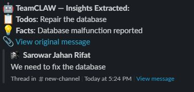
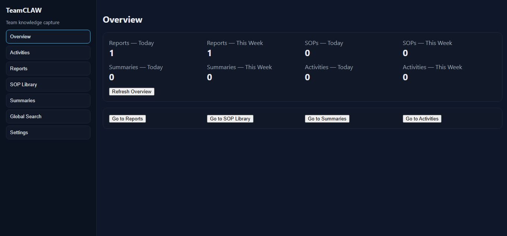

# TeamCLAW

> **Teams make critical decisions in Slack every day — and most of them disappear forever.**  
> TeamCLAW runs silently in the background, listening to your team's conversations and automatically extracting decisions, action items, and key facts into a searchable knowledge base.

**No manual note-taking. No missed follow-ups. No forgotten decisions.**

[](https://github.com/gsj-rifat/teamclaw/actions/workflows/ci.yml)
[](https://python.org)
[](https://fastapi.tiangolo.com)

**Stack:** FastAPI · Groq LLM (Llama 3.3 70B) · PostgreSQL · Slack Events API · Jira (optional)

**Author:** [gsj-rifat](https://github.com/gsj-rifat)

---

## The Problem

In fast-moving teams, important decisions happen in Slack threads — sprint decisions, architecture choices, assigned tasks. But Slack is a stream, not a knowledge base. Within days, those decisions are buried and forgotten.

## What I Built

A production-ready AI backend that:

- **Listens** to Slack channels via webhook (no polling, no manual triggers)
- **Filters** noise using an LLM-based signal detector to skip irrelevant chatter
- **Extracts** structured insights — decisions, todos with assignees/due dates, and facts — using a prompted Llama 3.3 70B model via Groq
- **Persists** everything to PostgreSQL with full multi-tenant isolation
- **Surfaces** insights through a REST API and a live dashboard
- **Syncs** todos to Jira automatically when configured

I built this after seeing decisions get lost in Slack threads during sprints — to prove I could design a multi-tenant backend, not just call an LLM API.

## Features

Full reference: **[docs/FEATURES.md](docs/FEATURES.md)**

| Area | Capabilities |
|:-----|:-------------|
| **Slack** | Webhook ingestion, HMAC verification, `@mentions`, thread replies, optional summary channel |
| **Noise filter** | Skips short messages (default min 12 chars) and low-signal chatter via LLM triage |
| **AI extraction** | Decisions, todos (assignee + due date), facts — Chief-of-Staff tone normalization |
| **Storage** | PostgreSQL with multi-tenant isolation, Proof of Insight (Slack permalink) |
| **Jira** | Auto-create tasks from extracted todos (optional) |
| **Reports** | Daily & weekly LLM-synthesized reports via REST API |
| **Dashboard** | Overview, Activities, Reports, Global Search, SOP Library, Summaries |
| **SOP** | Readiness check + LLM generation from context (`POST /sop/generate`) |

**Noise filter defaults:** messages under 12 characters (e.g. `hello`, `thanks`) are ignored; longer messages are classified by the LLM. Tune via `NOISE_MIN_CHARS`, `NOISE_LLM_THRESHOLD`, `NOISE_FILTER_ENABLED` — see [FEATURES.md § Noise filter](docs/FEATURES.md#2-noise-filter-what-gets-ignored).

> **Note:** SOP list/save and Summaries archive UIs are built; database persistence for those is still on the [roadmap](#roadmap).

## Demo

See [docs/DEMO.md](docs/DEMO.md) for the input → output walkthrough.





A message like:

> *"We decided to go with PostgreSQL over MongoDB. @rifat can you set up the schema by Friday?"*

Produces this structured insight, stored and searchable within seconds:

```json
{
  "type": "decision",
  "content": "Use PostgreSQL over MongoDB",
  "todo": {
    "assignee": "@rifat",
    "due_date": "Friday",
    "jira_issue": "ENG-42"
  },
  "source_url": "https://yourteam.slack.com/archives/..."
}
```

## Skills Demonstrated

| Area | What's in this project |
|:-----|:-----------------------|
| LLM / AI Engineering | Prompt engineering with structured output, noise filtering, Groq API integration |
| Backend / API | Async FastAPI, REST design, HMAC webhook verification, background tasks |
| Data & Storage | PostgreSQL with asyncpg, JSONB, multi-tenant schema design, Supabase cloud |
| System Design | Hexagonal architecture, dependency injection, interface-driven adapters |
| DevOps | Render deployment, GitHub Actions CI, environment-based config |
| Integrations | Slack Events API, Jira REST API, multi-service orchestration |

### Discussion points

| Topic | Talking point |
|:------|:--------------|
| Slack 3-second timeout | Return 200 immediately; process in FastAPI `BackgroundTasks`. |
| Swapping LLM providers | Implement `LLMProvider` ABC; wire a new adapter in `container.py`. |
| Multi-tenancy | Every DB query scoped by `tenant_id`; Slack `team_id` maps to tenant rows. |

---

## Connect Your Slack & Jira

**Use your own workspace?** Follow the full step-by-step guide:

### → [docs/CONNECT_SLACK_JIRA.md](docs/CONNECT_SLACK_JIRA.md)

That guide walks you through everything in order — no jumping between sections:

1. **Deploy or run the server** (Render or local + ngrok)
2. **Create and configure your Slack app** (events, scopes, install, invite bot)
3. **Set environment variables** (Groq, Postgres, Slack tokens)
4. **Connect Jira** (optional — API token and project key)
5. **Verify connections** (`verify_integrations.py` + `/health`)
6. **Send a test message** and confirm dashboard + thread reply

You only need to change **Slack app settings** and **environment variables** — no code changes required for a standard setup.

---

## Architecture & Design Decisions

I followed a **ports-and-adapters (hexagonal) pattern** to keep business logic decoupled from external services. The LLM provider, database, and messaging platform can each be swapped by implementing a new adapter — core extraction logic stays unchanged.

**Key decisions:**

- **Async throughout** — FastAPI + asyncpg returns 200 to Slack immediately while processing runs in the background
- **Multi-tenancy by design** — every DB query is scoped by `tenant_id` from day one
- **Interface-first** — `core/interfaces/` defines ABCs that adapters implement, enabling easy mocking in tests

```
Slack Message
     │
     ▼
POST /slack/events  ──►  Tenant resolution (Slack team_id)
     │                          │
     ▼                          ▼
MessageWorkflow  ◄──  InsightExtractor (Groq LLM)
     │
     ├──► PostgreSQL (insights, tenants, SOPs)
     ├──► Jira (optional — create tickets from todos)
     └──► Slack (thread reply + target channel summary)

Dashboard / APIs  ◄──  ReportBuilder, SopGenerator
```

| Layer | Path | Responsibility |
|:------|:-----|:---------------|
| Core | `src/core/` | Interfaces (ABCs), Pydantic models, pure logic |
| Adapters | `src/adapters/` | Groq, Postgres, Slack, Jira implementations |
| Infrastructure | `src/infrastructure/` | Config, DI container, DB schema, LLM prompts |
| API | `src/api/routes/` | FastAPI route handlers |
| Frontend | `dashboard_static/` | Static dashboard (HTML/CSS/JS, no build step) |

---

## Repository structure

```
teamclaw/
├── main.py
├── requirements.txt
├── runtime.txt
├── render.yaml
├── .env.example
├── dashboard_static/
├── docs/
│   ├── CONNECT_SLACK_JIRA.md    ← connect your own Slack & Jira
│   ├── FEATURES.md              ← full feature reference
│   ├── DEMO.md
│   └── screenshots/
├── scripts/
│   └── verify_integrations.py
├── src/
│   ├── adapters/
│   ├── api/routes/
│   ├── core/
│   └── infrastructure/
└── tests/
```

---

## Getting started (local development)

```bash
git clone https://github.com/gsj-rifat/teamclaw.git
cd teamclaw
python -m venv .venv
source .venv/bin/activate   # Windows: .venv\Scripts\activate
pip install -r requirements.txt
cp .env.example .env
uvicorn main:app --reload --port 5000
```

| URL | Purpose |
|:----|:--------|
| http://localhost:5000/dashboard | Dashboard UI |
| http://localhost:5000/docs | Swagger API docs |
| http://localhost:5000/health | Health check |

To connect Slack locally, you need a public tunnel — see **Step 1** in [docs/CONNECT_SLACK_JIRA.md](docs/CONNECT_SLACK_JIRA.md).

---

## Environment variables

For the full setup walkthrough (what to copy from Slack/Jira and where to paste it), see **Step 3** in [docs/CONNECT_SLACK_JIRA.md](docs/CONNECT_SLACK_JIRA.md).

Quick reference:

| Variable | Required | Description |
|:---------|:---------|:------------|
| `GROQ_API_KEY` | Yes | Groq API key |
| `DATABASE_URL` | Yes | PostgreSQL URL (`postgresql+asyncpg://...`) |
| `SLACK_BOT_TOKEN` | Yes | Slack bot OAuth token (`xoxb-...`) |
| `SLACK_SIGNING_SECRET` | Yes | Slack signing secret |
| `TARGET_CHANNEL_ID` | No | Channel for summary posts (alias: `SLACK_CHANNEL_ID`) |
| `JIRA_BASE_URL` | No | Jira Cloud URL |
| `JIRA_EMAIL` | No | Atlassian account email |
| `JIRA_API_TOKEN` | No | Atlassian API token |
| `JIRA_PROJECT_KEY` | No | Project key (e.g. `ENG`) |
| `DASHBOARD_TENANT_ID` | No | Override dashboard tenant scope |
| `DEFAULT_TENANT_ID` | No | Default tenant UUID |
| `NOISE_MIN_CHARS` | No | Min message length before LLM triage (default: `12`) |
| `NOISE_LLM_THRESHOLD` | No | Confidence cutoff for noise filter (default: `0.55`) |
| `NOISE_FILTER_ENABLED` | No | Toggle noise filter (default: `true`) |

Template: [.env.example](.env.example) · Feature details: [FEATURES.md](docs/FEATURES.md)

---

## Testing

```bash
pytest tests/ -v
```

CI runs the full test suite on every push via GitHub Actions.

Manual integration check (requires real `.env` — see [CONNECT_SLACK_JIRA.md](docs/CONNECT_SLACK_JIRA.md#step-5--verify-everything-is-connected)):

```bash
python scripts/verify_integrations.py
```

---

## Roadmap

- [ ] SOP persistence (wire dashboard SOP Library to PostgreSQL)
- [ ] Summaries storage and retrieval
- [ ] Dashboard auth (wire `X-Auth-Token` to roles)
- [ ] Structured logging migration for remaining adapter paths
- [ ] Additional connectors (email, docs, other trackers)

---

## About This Project

Personal portfolio project by [gsj-rifat](https://github.com/gsj-rifat). Feedback welcome via Issues.

## License

MIT License — see [LICENSE](LICENSE).

<!-- CV bullet: Built TeamCLAW — a production AI backend (FastAPI + Groq LLM + PostgreSQL) that monitors Slack channels, extracts structured decisions/todos using LLM prompt engineering, and syncs to Jira — featuring hexagonal architecture, multi-tenancy, and async processing. -->
